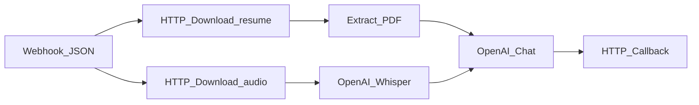

# n8n workflows

Import workflows from `workflows/` into your n8n instance (Cloud or self-hosted).

| File | Use |
|------|-----|
| `mvp-form-trigger.workflow.json` | 2-hour validation — Form Trigger UI, email report |
| `v1-webhook-supabase.workflow.json` | Production — Webhook JSON from browser, callback to Next.js |

Prompt assets in `prompts/` are the source of truth; paste into OpenAI Chat nodes during setup.

## Browser → Supabase Storage → n8n (JSON)

The app does **not** send multipart files to n8n (avoids self-hosted binary-data bugs), and the **video is converted to audio server-side before upload** so it stays under Whisper's 25 MB limit. Flow:

1. `POST /api/upload/presign` — signed PUT URL for the resume
2. Browser `PUT`s the resume to Supabase Storage
3. Browser `POST`s the video to `POST /api/upload/audio`; the server runs ffmpeg, extracts a small mono MP3, and uploads it to Storage
4. `POST /api/candidates` — creates DB row, returns signed **download** URLs (24h) for resume + audio
5. Browser `POST`s JSON to `NEXT_PUBLIC_N8N_SCREEN_WEBHOOK_URL`

### Webhook body (JSON)

Configure the Webhook node: **POST**, **Respond: Immediately**, **no Binary Data option**.

```json
{
  "candidateId": "uuid",
  "jdText": "Full job description text…",
  "resumeUrl": "https://…/storage/v1/object/sign/screener-uploads/…/resume",
  "audioUrl": "https://…/storage/v1/object/sign/screener-uploads/…/audio.mp3"
}
```

> n8n receives **audio**, not video. There is no video download or ffmpeg step in n8n.

## Recommended n8n node chain



| Step | Node | Notes |
|------|------|--------|
| 1 | **Webhook** | POST, respond immediately, JSON body only |
| 2 | **HTTP Request** — Download resume | GET `{{$json.body.resumeUrl}}`, response format **File** |
| 3 | **Extract from File** | PDF from resume binary → `resumeText` |
| 4 | **HTTP Request** — Download audio | GET `{{$json.body.audioUrl}}`, response format **File** |
| 5 | **OpenAI** — Transcribe | Whisper on audio binary → `transcript` |
| 6 | **OpenAI Chat** | Score using `jdText`, `resumeText`, `transcript` |
| 7 | **HTTP Request** | Callback to Next.js (below) |

Pin fields early with a **Set** node: `candidateId`, `jdText` from `{{$json.body.*}}`.

Wire error outputs to a callback with `"status": "failed"` only.

## n8n → Next.js callback

When scoring finishes (or fails), POST results to the app:

```
POST {NEXT_PUBLIC_APP_URL}/api/screenings/callback
Content-Type: application/json
x-webhook-secret: <N8N_CALLBACK_SECRET>
```

### Body (complete)

```json
{
  "candidateId": "uuid",
  "status": "complete",
  "overall_score": 72,
  "summary": "Strong outbound experience…",
  "strengths": [
    { "dimension": "Outbound", "score": 8, "evidence": "…" }
  ],
  "weaknesses": [
    { "dimension": "Enterprise", "score": 4, "evidence": "…" }
  ],
  "transcript": "Optional Whisper transcript",
  "raw": { "model": "gpt-4o", "red_flags": [] }
}
```

### Body (failed)

```json
{
  "candidateId": "uuid",
  "status": "failed"
}
```

On `complete`, the API upserts a `screenings` row and sets the candidate to `complete`. On `failed`, only the candidate status is updated.

If the browser cannot reach the n8n webhook, it calls `POST /api/candidates/{id}/fail`.

## Storage cleanup

Files in bucket `screener-uploads` are deleted after **7 days** via `pg_cron` (see `supabase/migrations/002_storage.sql`).
